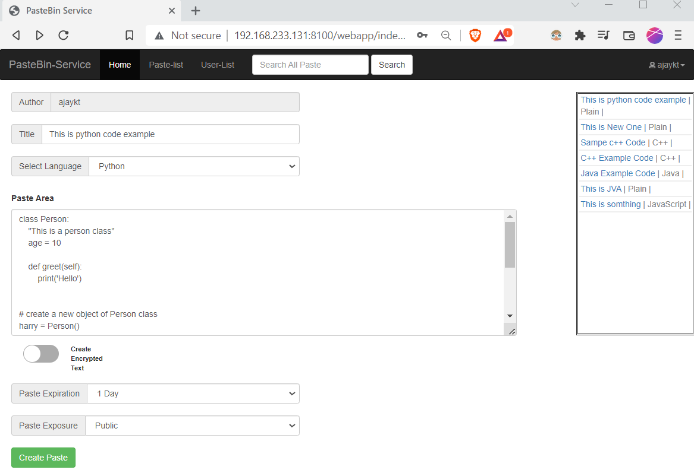
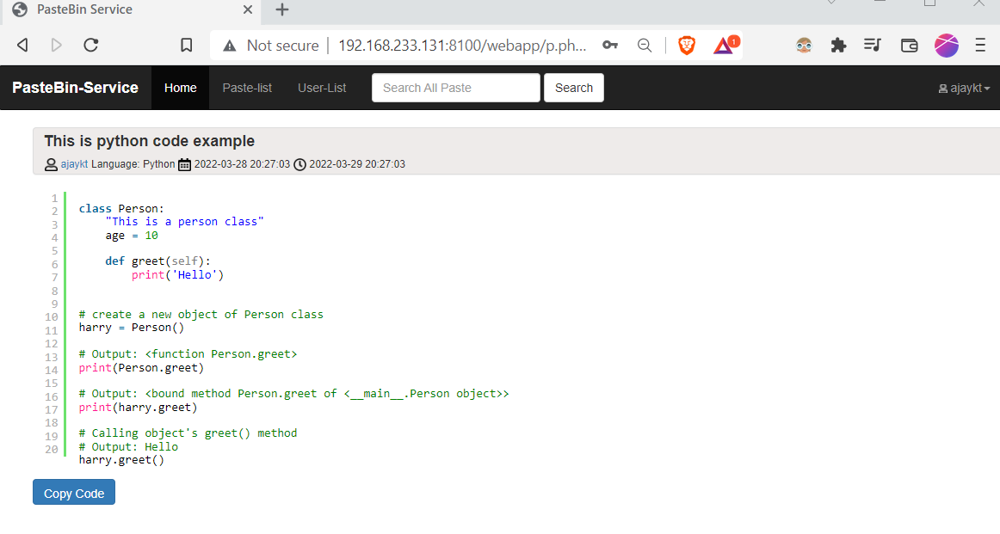
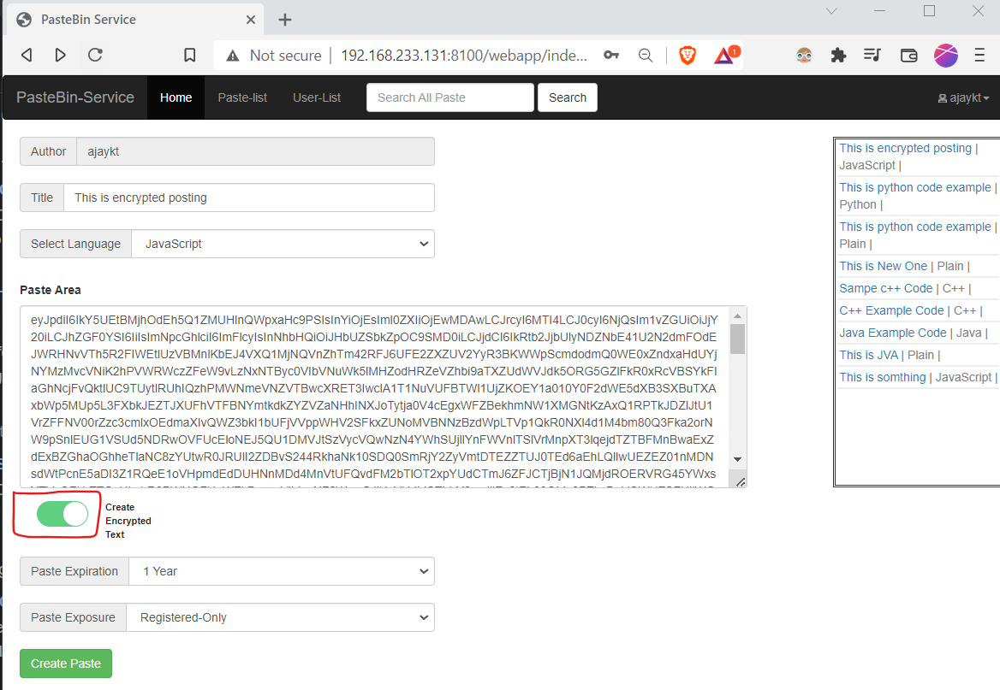
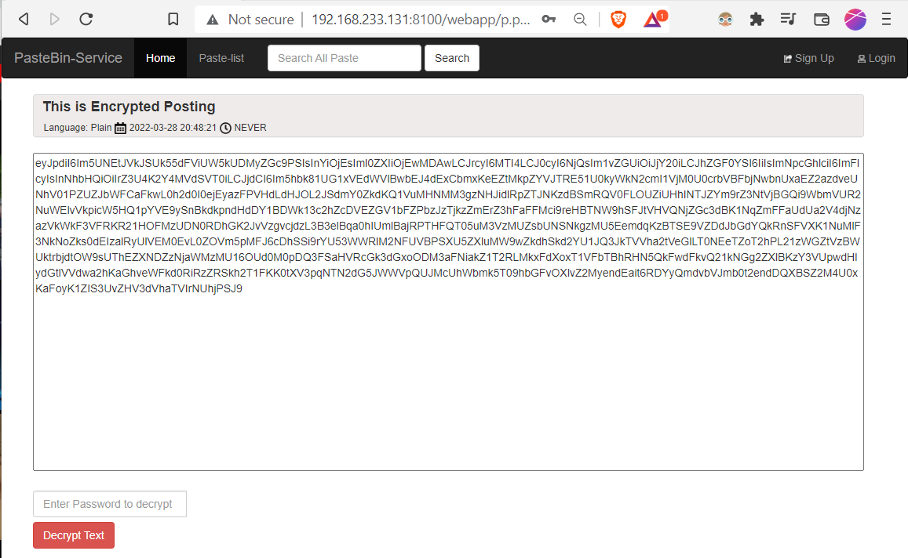
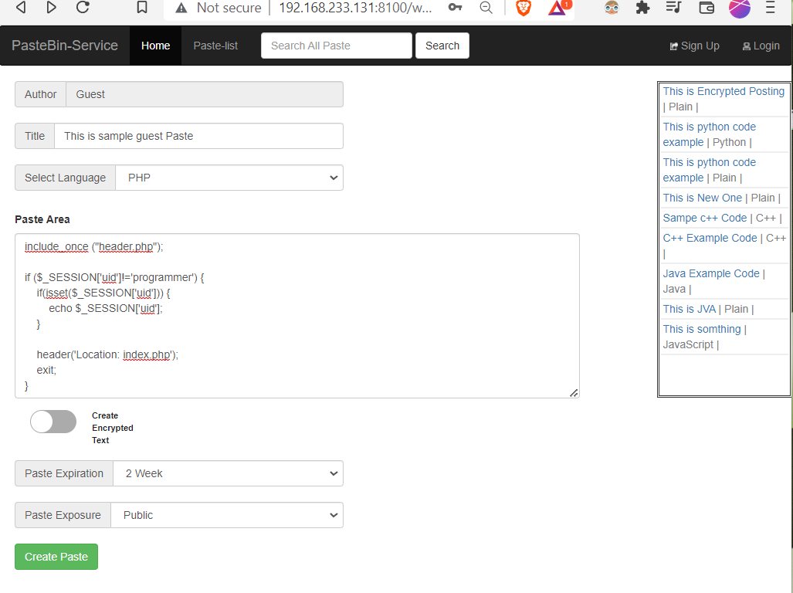
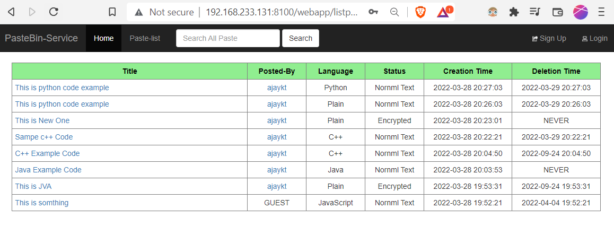

## PasteBin App 

A [PasteBin](https://en.wikipedia.org/wiki/Pastebin) app to share your codes/notes with other people. The App is entirely written in code php with mysql as database. 

### Features :  

* Public and Private Note pasting 
* Multiple Programming Language for Syntax Highlighting   
* Set Post Expiration Date/Time
* Paste Notes as a guest or registerd user  
* Post encrypted paste  
* Client side encryption using 
* Post encrypted paste using [sjcl.js](https://crypto.stanford.edu/sjcl/)   
* Paste Search Bar  

###  Usage :  

* Install docker and docker-compose.
* Close the repository
* Change directory to pastebin, then run `docker-compose up` command 
* Now browse to the `http://localhost:8100/webapp/`

### Library Used 

* [SJCL](https://crypto.stanford.edu/sjcl/)     
* [Bootstrap](https://getbootstrap.com/)   
* [SyntaxHighlighter](https://cdnjs.com/libraries/SyntaxHighlighter)   

### Screenshots  

__Paste Creation :__  

__Stored Paste :__    

  

__Encrypted Paste :__    

__Guest Paste :__  

__Paste Lists :__  

